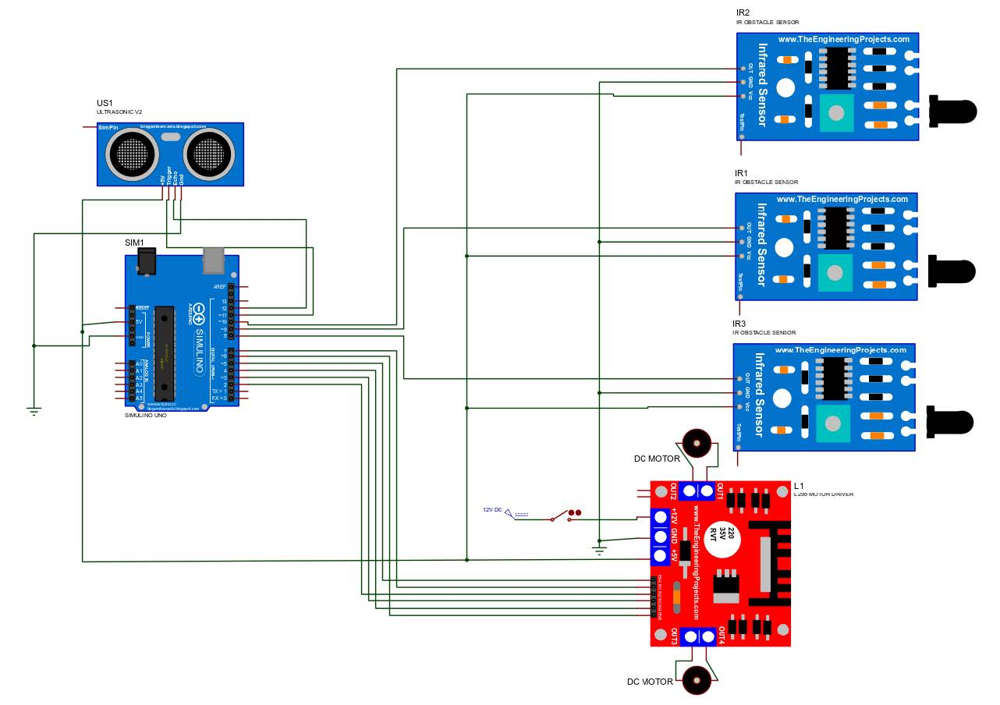

  <h1> RC Line Tracking Object Detection</h1>
  

  
  
  <h3>  Tracks a blackline (curved or straight) or an object turnning around it continuing its way like normal.</h3>
  
  

## :star2: About The Project
The line follower robot is an automated vehicle that follows a visual line embedded on the surface. Generally, it uses a black line on a white surface, or you can adjust it as a white line on a black surface.

In industries, giant line follower robots are used for assisting the automated production process. They are also used in military applications, human assistance purposes, delivery services, etc.

## :mag_right: Circuit Diagram

## :video_camera: Sample Video

https://github.com/Andrew-Ayman123/Arduino-RC-Line-Tracking-Object-Detection/assets/88400418/19923ae6-fe94-49ed-b5ee-647a157b8f98

## :telescope: More Details
**Project Report**: [car_project_final_documentation_g37.pdf](https://github.com/Andrew-Ayman123/Arduino-RC-Line-Tracking-Object-Detection/blob/main/assets/car_project_final_documentation_g37.pdf)
